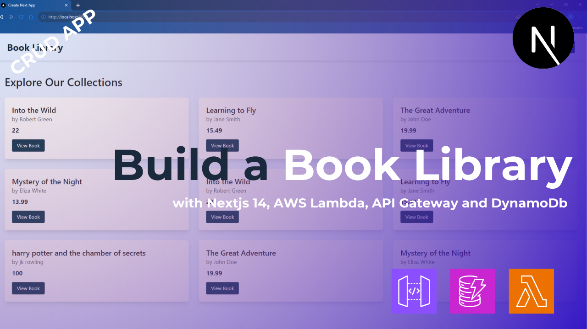

# How to Build a Book Library (CRUD App) with Nextjs 14, AWS Lambda, AWS Api Gateway and DynamoDb

A simple Book Library app built using **Next.js 14**, **Tailwind CSS**, **AWS DynamoDB**, **AWS Lambda** and **AWS API Gateway**. This app showcases CRUD (Create, Read, Update, Delete) operations for managing books, with server actions in Next.js and DynamoDB as the database.



Youtube: [Watch](https://www.youtube.com/watch?v=ygBVY_Veblk)

Article: [blog](https://thetechmaze.com/blog/how-to-build-a-book-library-with-nextjs-14-aws-lambda-aws-api-gateway-and-dynamodb)

## Prerequisites

- **Node.js** installed locally.
- An **AWS account** to use DynamoDB, Lambda and API Gateway.
- AWS API Gateway URL added to `.env.local`.

## Getting Started

1.  **Clone the repository:**

    ```bash
    git clone https://github.com/thetechmaze/book-library-next-dynamo.git
    ```

2.  **Install Dependencies**

    ```bash
    npm install
    ```

3.  ** AWS SETUP **

    Make sure that you have the aws dynamodb, lambda and api gatway ready by following this [article](https://thetechmaze.com/blog/how-to-build-a-book-library-with-nextjs-14-aws-lambda-aws-api-gateway-and-dynamodb) or [video](https://www.youtube.com/watch?v=ygBVY_Veblk)

4.  **Set up Environment variables**

    Create a `.env.local` file in the root directory and add your AWS credentials:

    ```bash
    AWS_API_URL=your-url
    ```

5.  **Run the development server**

    ```bash
    npm run dev
    ```

    Open http://localhost:3000 in your browser to see the app in action.

## Deployment

To Deploy this app, you can use platforms like Vercel or Netlify. Ensure you have your environment variables set correctly on the chosen platform.

## Format

`<type>(optional scope): <description>`
Example: `feat(pre-event): add speakers section`

### 1. Type

Available types are:

- feat → Changes about addition or removal of a feature. Ex: `feat: add table on landing page`, `feat: remove table from landing page`
- fix → Bug fixing, followed by the bug. Ex: `fix: illustration overflows in mobile view`
- docs → Update documentation (README.md)
- style → Updating style, and not changing any logic in the code (reorder imports, fix whitespace, remove comments)
- chore → Installing new dependencies, or bumping deps
- refactor → Changes in code, same output, but different approach
- ci → Update github workflows, husky
- test → Update testing suite, cypress files
- revert → when reverting commits
- perf → Fixing something regarding performance (deriving state, using memo, callback)
- vercel → Blank commit to trigger vercel deployment. Ex: `vercel: trigger deployment`

### 2. Optional Scope

Labels per page Ex: `feat(pre-event): add date label`

\*If there is no scope needed, you don't need to write it

### 3. Descriptions

Description must fully explain what is being done.

Add BREAKING CHANGE in the description if there is a significant change.

**If there are multiple changes, then commit one by one**

- After colon, there are a single space Ex: `feat: add something`
- When using `fix` type, state the issue Ex: `fix: file size limiter not working`
- Use imperative, and present tense: "change" not "changed" or "changes"
- Don't use capitals in front of the sentence
- Don't add full stop (.) at the end of the sentence

## Team Members

- 5026221085 - Dzaky Purnomo Rifa'i
- 5026221086 - Darrell Valentino Widjaja
- 5026221089 - Frans Nicklaus Gusyanto
- 5026221096 - Viera Tito Virgiawan

## License

This project is open source and available under the [MIT Licence](./LICENCE).
